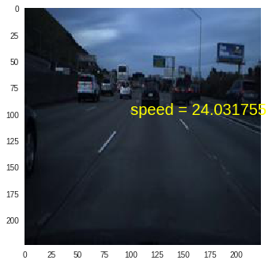
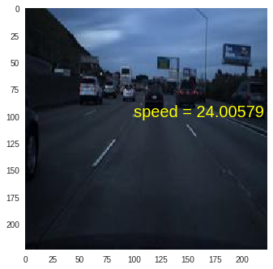
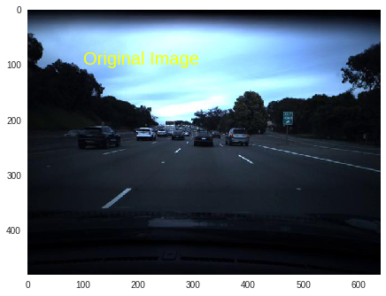
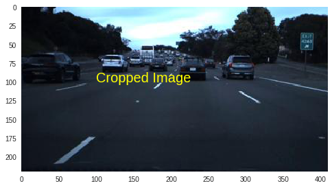
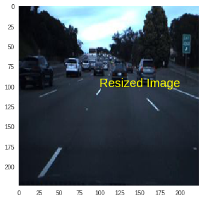

# Vehicle Speed Estimation

## Task
Given a frame/video of dashboard camera, the task is to predict the Speed of the vehicle.



## Task Insights
### Convolutional Neural Network:
When we think about this problem in Deep Learning perspective, the first thought is to use a Convolutional Neural Network to extract the features of each frame and use fully connected layers to regress the output(speed).

#### Data Processing
But the data is not completely useful for this task as the sky or the car dash is not contributing for estimating the speed of the vehicle.


So we crop out the sky and the car dash.



and resize it into a square matrix to feed it to the neural network



#### Transfer Learning
As the data involves vehicles, pedestrians, ...etc, it is not possible for me to train a model from scratch(due to computational reasons), so we take the advantage of transfer learning by using pretrained models(which were trained over million of data and poweful GPUs). 

We first keep the pre trained weights of CNN layers and add a FCC classifier in the end and train the classifier for our task with MSELoss. Later we unfreeze some CNN layers so that the CNNs extract the features which are needed for the task.

```python
model = torchvision.models.X(pretrained=True)   
for param in model.parameters():
    param.requires_grad = False
    
for param in model.selected_features.parameters():
    param.requires_grad = True

```
X - any pretrained model of choice(due to computational purpose i used AlexNet, I tried using other models too but they were very slow in training)

And add a trainable classifier at the end
```python
classifier = torch.nn.Sequential(nn.Linear(512, 256),
                           nn.ReLU(),
                           nn.Dropout(0.2),
                           nn.Linear(256, 128),
                           nn.ReLU(),
                           nn.Dropout(0.2),
                           nn.Linear(128, 64),
                           nn.ReLU(),
                           nn.Dropout(0.2),
                           nn.Linear(64, 1),
                           nn.ReLU())
model.fc = classifier
```
The CNN Model is
```
AlexNet(
  (features): Sequential(
    (0): Conv2d(3, 64, kernel_size=(11, 11), stride=(4, 4), padding=(2, 2))
    (1): ReLU(inplace)
    (2): MaxPool2d(kernel_size=3, stride=2, padding=0, dilation=1, ceil_mode=False)
    (3): Conv2d(64, 192, kernel_size=(5, 5), stride=(1, 1), padding=(2, 2))
    (4): ReLU(inplace)
    (5): MaxPool2d(kernel_size=3, stride=2, padding=0, dilation=1, ceil_mode=False)
    (6): Conv2d(192, 384, kernel_size=(3, 3), stride=(1, 1), padding=(1, 1))
    (7): ReLU(inplace)
    (8): Conv2d(384, 256, kernel_size=(3, 3), stride=(1, 1), padding=(1, 1))
    (9): ReLU(inplace)
    (10): Conv2d(256, 256, kernel_size=(3, 3), stride=(1, 1), padding=(1, 1))
    (11): ReLU(inplace)
    (12): MaxPool2d(kernel_size=3, stride=2, padding=0, dilation=1, ceil_mode=False)
  )
  (avgpool): AdaptiveAvgPool2d(output_size=(6, 6))
  (classifier): Sequential(
    (0): Linear(in_features=9216, out_features=1024, bias=True)
    (1): ReLU()
    (2): Dropout(p=0.2)
    (3): Linear(in_features=1024, out_features=512, bias=True)
    (4): ReLU()
    (5): Dropout(p=0.2)
    (6): Linear(in_features=512, out_features=256, bias=True)
    (7): ReLU()
    (8): Dropout(p=0.2)
    (9): Linear(in_features=256, out_features=1, bias=True)
    (10): ReLU()
  )
)
```

When the model is trained with Adam Optimizer with lr=1e-3 for 50 epochs, without scaling the target (MSELoss)
```
Epoch: 1/50  Training Loss: 191.244  Test Loss: 26.860 
Validation loss decreased (inf --> 26.860056).  Saving model ...
Epoch: 2/50  Training Loss: 184.863  Test Loss: 20.556 
Validation loss decreased (26.860056 --> 20.555820).  Saving model ...
Epoch: 3/50  Training Loss: 138.888  Test Loss: 20.118 
Validation loss decreased (20.555820 --> 20.117861).  Saving model ...
Epoch: 4/50  Training Loss: 94.037  Test Loss: 18.397 
Validation loss decreased (20.117861 --> 18.397253).  Saving model ...
Epoch: 5/50  Training Loss: 67.736  Test Loss: 17.306 
Validation loss decreased (18.397253 --> 17.306036).  Saving model ...
Epoch: 6/50  Training Loss: 86.508  Test Loss: 21.395 
Epoch: 7/50  Training Loss: 49.428  Test Loss: 19.769 
Epoch: 8/50  Training Loss: 41.393  Test Loss: 16.113 
Validation loss decreased (17.306036 --> 16.112900).  Saving model ...
Epoch: 9/50  Training Loss: 23.331  Test Loss: 14.344 
Validation loss decreased (16.112900 --> 14.343948).  Saving model ...
Epoch: 10/50  Training Loss: 23.345  Test Loss: 14.337 
Validation loss decreased (14.343948 --> 14.336511).  Saving model ...
Epoch: 11/50  Training Loss: 23.899  Test Loss: 14.769 
Epoch: 12/50  Training Loss: 23.372  Test Loss: 14.211 
Validation loss decreased (14.336511 --> 14.211410).  Saving model ...
Epoch: 13/50  Training Loss: 20.840  Test Loss: 14.221 
Epoch: 14/50  Training Loss: 20.422  Test Loss: 14.730 
...
...
```

#### Observation and Conclusion for CNN-FCC Model
The model seem to converge very fast in the beginning and was observed to stop learning much after few epochs.
Although the Model was able to learn the data to an extent, the output of the model was observed to be nearly same for all the data.

##### why is that so? 
CNNs consider only the current data which you provide, it learns for some cars and road positions the speed has to be something.


But the problem is the same arrangement can be seen also when the speed = 0, So the CNN model doen't actually learn/observe the movement, rather it learns the positions and placements of vehicles,..etc. 
So using only CNNs can help us to some extent , but cannot be used for maximum accuracy, as for self driving cars increment in each decimal accuracy matters.


### Human Insight on speed estimation during car journey
As CNNs failed to give us good estimation of speed(atleast in my case, as i do not have more computing power to train more), we can analyse how a human will try to estimate the speed of a car(atleast relative).

To estimate a speed, we decide a reference point/place and we can estimate the relative speed by observing the difference at t th second and t+1 th second. By this we can observe(if not the accuracte estimate) the relative velocity of the car.

As the camera is in the car, the change in frames can help the model to find the relative change in other vehicle positions and the velocity of the car itself. And previous velocity will affect the current velocity of the car. If the car was moving at a speed of 30 units, it cannot suddent go to zero in the next frame , so the speed will be 30(+/-)x. x will be a small number.


### Time series Learning - Recurrent Neural Networks
We will use the previous data also woth current data to estimate the velocity. The best was to do this is to extract the features of the images with a CNNs and use RNNs to use previous data and current data to estimate the velocity.


This model can consider some features from the previous data and now the estimation becomes little easier as the model will have reference points to estimate relative velocity and find the current velocity.


#### Transfer Learning for CNNs
We again use transfer learning to extract features from the images(due to computational purposes and the advantage of learnt features from million of data).
